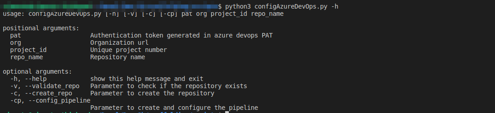

<h1 align="center"> Configure repository and pipeline with Azure DevOps Rest Api</h1>

Using Azure Devops Rest API to automate the process of creating the repository and pipeline, as well as configuring the policy, creating and starting the pipeline created.

- Example
```
  $ python3 configAzureDevOps.py -h
```


``` 
$ python3 configAzureDevOps.py <token PAT> <https://dev.azure.com/organization/> <project_id> <project_name> --validate_repo
``` 
``` 
$ python3 configAzureDevOps.py <token PAT> <https://dev.azure.com/organization/> <project_id> <project_name> --create_repo 
``` 
``` 
$ python3 configAzureDevOps.py <token PAT> <https://dev.azure.com/organization/> <project_id> <project_name> --config_pipeline
``` 

- Reference
  - [Pipelines REST API](https://docs.microsoft.com/en-us/rest/api/azure/devops/pipelines/?view=azure-devops-rest-6.0)
  - [Git REST API](https://docs.microsoft.com/en-us/rest/api/azure/devops/git/?view=azure-devops-rest-6.0)
  - [Policy REST API](https://docs.microsoft.com/en-us/rest/api/azure/devops/policy/?view=azure-devops-rest-6.0)
  - [Core REST API](https://docs.microsoft.com/en-us/rest/api/azure/devops/core/?view=azure-devops-rest-6.0)
